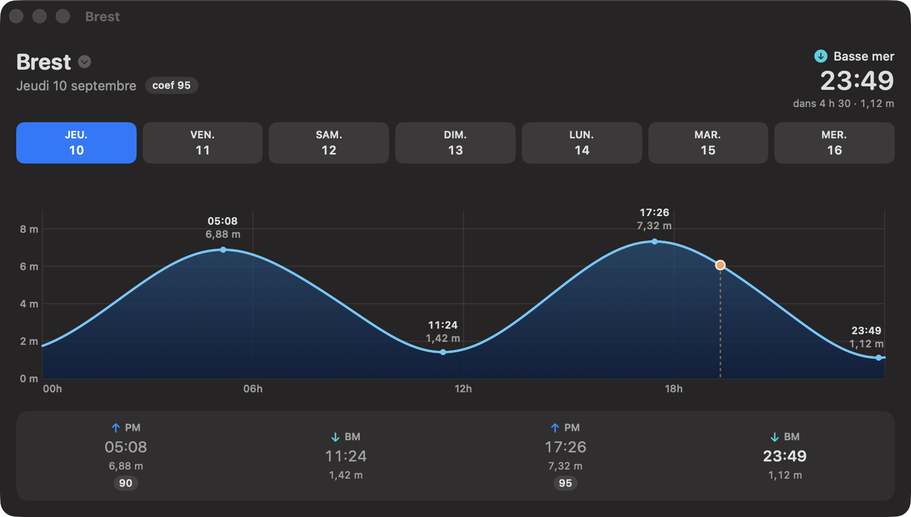

# Marées

[](https://github.com/gwenn-ha-dev/Mare/actions/workflows/ci.yml)

Prédiction de marées pour les ports français, en Swift pur, **zéro dépendance**
(pas de LAPACK, pas de package externe). Le moteur calcule ses propres
constantes harmoniques à partir des observations marégraphiques publiques —
il ne réutilise aucune prédiction ni constante du SHOM.

Le dépôt contient la bibliothèque `MareeKit`, la CLI `maree`, et une app macOS
avec son widget (`App/MareesApp`) couvrant 13 ports.



## Méthode

1. **Observations** : hauteurs d'eau validées des marégraphes REFMAR,
   téléchargées depuis `services.data.shom.fr/maregraphie` (données Shom/REFMAR,
   Licence Ouverte 2.0 Etalab). Voir `scripts/fetch_observations.sh`.
2. **Analyse harmonique** : moindres carrés sur 2 ans d'observations, 33
   constituants (arguments de Doodson, corrections nodales de Schureman),
   équations normales résolues par Cholesky. Là où l'onde est fortement
   déformée par les petits fonds, `--jeu etendu` ajoute 10 composés
   supplémentaires (2SM2, SO3, SK3, 3MS4, SN4, S4, MSN6, 2SM6, 3MS8, M10),
   engendrés par composition des ondes astronomiques plutôt que recopiés.
3. **Prédiction** : somme harmonique, extrema (PM/BM) par recherche ternaire,
   coefficient de marée calculé à Brest par définition
   (pic semi-diurne / unité de hauteur 3,05 m).

## Usage

```sh
swift build -c release

# 1. Télécharger les observations d'une station (Brest = station REFMAR n° 3)
scripts/fetch_observations.sh 3 2023-01 2026-07 data/brest

# 2. Calculer les constantes harmoniques
.build/release/maree analyse data/brest --station Brest --id 3 \
    --debut 2023-01-01 --fin 2025-01-01 -o stations/brest.json

# 3. Valider sur une période hors fit
.build/release/maree valide stations/brest.json data/brest --debut 2025-01-01 --fin 2026-07-01

# 4. Prédire
.build/release/maree jour --constantes stations/brest.json --date 2026-08-19 --jours 3

# Pour tout autre port, la référence de Brest est requise pour les coefficients
# (le coefficient est défini au port de Brest) — sans elle, ils sont omis.
.build/release/maree jour --constantes stations/le-havre.json \
    --brest stations/brest.json --date 2026-08-19
```

## Ports embarqués (fit 2023–2024, validation hors fit 2025-01 → 2026-07)

13 ports RONIM. Les constantes vivent dans `stations/<slug>.json` — un seul
exemplaire, lu à la fois par la CLI, les tests et le bundle de l'app — et les
observations sont **versionnées dans le dépôt** (`data/<slug>`, 36 Mo) afin que le
tableau ci-dessous et la suite de tests soient reproductibles sans rien
télécharger. Le coefficient est toujours calculé à Brest
(définition officielle) : la marée de Brest concomitante est recherchée dans
±9 h, ce qui couvre les déphasages de la Manche Est.

| Port | id REFMAR | constituants | biais | RMS hors fit |
|---|---|---|---|---|
| Dunkerque | 2 | 43 | −3,0 cm | 21,4 cm |
| Boulogne-sur-Mer | 111 | 43 | −2,2 cm | 21,0 cm |
| Dieppe | 24 | 43 | −1,0 cm | 19,7 cm |
| Le Havre | 4 | 43 | −1,2 cm | 19,4 cm |
| Cherbourg | 13 | 33 | −2,0 cm | 13,6 cm |
| Saint-Malo | 410 | 43 | +0,6 cm | 20,2 cm |
| Roscoff | 54 | 43 | +2,9 cm | 16,1 cm |
| Brest | 3 | 33 | +1,0 cm | 15,5 cm |
| Le Conquet | 152 | 33 | +1,8 cm | 15,1 cm |
| Concarneau | 160 | 33 | +2,7 cm | 15,9 cm |
| Saint-Nazaire | 37 | 33 | +0,1 cm | 17,6 cm |
| La Rochelle–Pallice | 34 | 33 | +3,6 cm | 17,6 cm |
| Boucau-Bayonne | 94 | 33 | −0,9 cm | 14,2 cm |

Le jeu étendu (43 constituants) n'est retenu que là où il gagne quelque chose,
mesuré hors fit sur les 18 mois de validation :

| | Dunkerque | Boulogne | Dieppe | Le Havre | Saint-Malo | Roscoff | Brest | Concarneau | La Rochelle |
|---|---|---|---|---|---|---|---|---|---|
| gain | 0,5 cm | 0,9 cm | 1,0 cm | 1,0 cm | 1,2 cm | 0,3 cm | 0,0 cm | 0,0 cm | 0,0 cm |

Le partage est net : les composés d'eaux peu profondes paient en Manche Est et
en baie de Saint-Malo, et ne paient nulle part ailleurs — les sept ports où le
gain est nul ou marginal (≤ 0,1 cm) gardent les 33 constituants. Brest en
particulier reste au jeu standard : le refit à 43 ne gagne rien (0,0 cm) mais
déplacerait ses PM/BM jusqu'à 10 min, ses hauteurs de 3,6 cm et 257 de ses 706
coefficients annuels d'un point — soit perturber, sans contrepartie, la
référence des coefficients de tous les autres ports.

Il reste ~19–21 cm de RMS en Manche Est après cette amélioration : cette part
est de la surcote météo, que la marée astronomique ne prédit pas.

## Précision constatée (Brest, fit 2023–2024, tests 2025–2026)

- Hauteurs vs observations réelles (18 mois hors fit) : biais +1 cm,
  RMS 15,5 cm — ce résidu est dominé par la surcote météorologique réelle,
  que la marée astronomique ne prédit pas (par construction).
- Horaires PM/BM vs prédictions officielles : écart médian ≈ 3 min,
  jusqu'à ~15 min sur les marées de très faible coefficient (extremum plat).
- Coefficients : écart de 0 à 2 points vs valeurs publiées.
- Hauteurs PM/BM vs prédictions officielles : nos valeurs sont ~13 cm au-dessus,
  mais **sans biais vs les observations réelles** — l'écart reflète
  vraisemblablement l'époque de référence du niveau moyen dans les prédictions
  officielles (élévation du niveau marin), pas une erreur du moteur.

## Limites assumées

- Prédiction purement astronomique : pas de surcote/décote météo.
- À une nuance près, qui joue en notre faveur : `Sa` et `Ssa` ajustés sur 2 ans
  ne sont pas purement astronomiques. Ils absorbent le cycle saisonnier
  stérique et météorologique — à Brest, `Sa` = 5,6 cm et `Ssa` = 5,2 cm, quand
  la seule contribution astronomique est de l'ordre du centimètre. La
  prédiction porte donc une saisonnalité climatologique moyenne, ce qui
  explique en partie un biais annuel aussi bas ; elle ne prédit toujours pas la
  surcote d'une dépression donnée.
- L2 utilise la correction nodale de M2 (approximation documentée) : la
  formule exacte de Schureman (éq. 213–215) module f et u sur 8,85 ans, ce que
  le fit sur 2 ans n'absorbe pas — coût estimé : quelques cm au plus à Brest.
- Convention de phase interne : l'origine de τ (minuit, type Doodson) décale
  les situations g des ondes **diurnes** de 180° par rapport aux constantes
  publiées (Schureman/SHOM). Sans aucun effet sur les prédictions — analyse et
  prédiction partagent la convention — mais ne pas importer de constantes
  externes sans corriger ce décalage.
- **Pas un outil de navigation.** Pour toute utilisation engageant la sécurité,
  seules les prédictions officielles du SHOM font foi.

## Tests

`swift test` fonctionne dès le clone : les observations nécessaires sont dans
le dépôt. Il rejoue notamment la validation hors fit sur ces observations avec des seuils calés sur les chiffres ci-dessus (biais < 3 cm,
RMS < 18 cm, horaires de PM vs observations, structure des extrema,
dynamique des coefficients). `OfficialPredictionTests` accepte en plus des
PM/BM officielles saisies à la main (fixture vide par défaut) pour une
confrontation directe aux prédictions du SHOM.

La CI GitHub Actions (`.github/workflows/ci.yml`) rejoue tout cela sur un
runner macOS à chaque push : build, tests, une prédiction et une validation de
bout en bout, plus la compilation de l'app et du widget avec vérification que
les 13 constantes atterrissent dans les deux bundles.

## Licence

Code (MareeKit, CLI `maree`, app et widget) : **MIT** — voir `LICENSE`.

## Attribution

Observations marégraphiques du dossier `data/` : **Shom / REFMAR** —
data.shom.fr, **Licence Ouverte 2.0 (Etalab)**, qui en autorise la
redistribution sous réserve de cette attribution. Elles ne sont pas couvertes
par la licence MIT du code.
